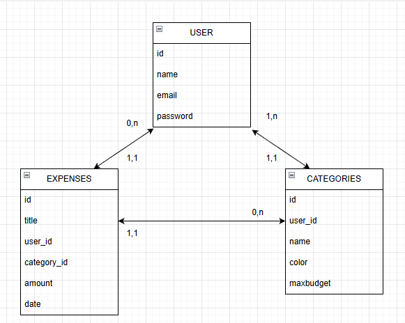

## MCD

- USER (user code, name, email, password)  
- EXPENSE (expense code, title, amount, date)  
- CATEGORY (category code, name, color, maxbudget) 

-- un USER a (0, N) EXPENSE  
-- une EXPENSE a (1, 1) USER  
-- une CATEGORY a (0, N) EXPENSE  
-- une EXPENSE a (1,1) CATEGORY  
-- un USER a (1,N) CATEGORY  
-- une CATEGORY a (1,1) USER  

Attention !  
-> Une catégorie par défaut sera créée à l’inscription d’un user  
-> Un user ne peut pas supprimer la dernière catégorie !

## MLD
- USER (id, name, email, password)  
- EXPENSE (id, title, amount, date, category_id, user_id)  
- CATEGORY (id, name, color, user_id, maxbudget)  

## Dictionnaire de données